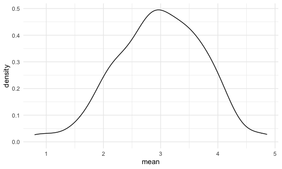
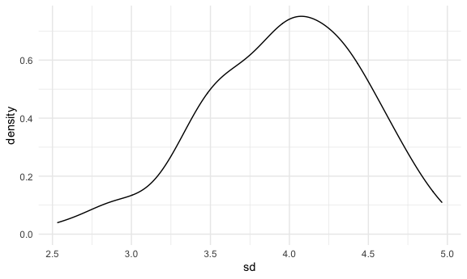

Simulations
================

## Let’s simulate something

I have a function.

``` r
sim_mean_sd = function(samp_size, mu = 3, sigma = 4) {
  
  sim_data =
    tibble(
      x = rnorm(n = samp_size, mean = mu, sd = sigma)
  )

  sim_data %>% 
    summarize(
      mean = mean(x),
      sd = sd(x)
  ) 
  
}
```

I can “simulate” by running this line.

``` r
sim_mean_sd(30)
```

    ## # A tibble: 1 x 2
    ##    mean    sd
    ##   <dbl> <dbl>
    ## 1  2.43  3.58

## Let’simulate a lot

Let’s start with a for loop.

``` r
output = vector("list", length = 100)

for (i in 1:100) {
  
  output[[i]] = sim_mean_sd(samp_size = 30)

}

bind_rows(output)
```

    ## # A tibble: 100 x 2
    ##     mean    sd
    ##    <dbl> <dbl>
    ##  1  2.97  3.98
    ##  2  4.65  3.32
    ##  3  2.07  3.72
    ##  4  2.95  4.62
    ##  5  2.10  4.32
    ##  6  3.34  3.42
    ##  7  3.92  3.37
    ##  8  2.48  3.74
    ##  9  3.69  2.77
    ## 10  2.13  3.67
    ## # … with 90 more rows

``` r
## this underlies all of statistics
```

Let’s use a loop function. (In above, there is no input list, only an
output list)

``` r
sim_results = 
  rerun(100, sim_mean_sd(samp_size = 30)) %>% 
  bind_rows()
## set.seed can standardize the sampling
```

Let’s look at results…

``` r
sim_results %>% 
  ggplot(aes(x = mean)) + geom_density()
```



``` r
sim_results %>% 
  summarize(
    avg_samp_mean = mean(mean),
    sd_samp_mean = sd(mean)
  )
```

    ## # A tibble: 1 x 2
    ##   avg_samp_mean sd_samp_mean
    ##           <dbl>        <dbl>
    ## 1          2.99        0.727

``` r
sim_results %>% 
  ggplot(aes(x = sd)) + geom_density()
```


